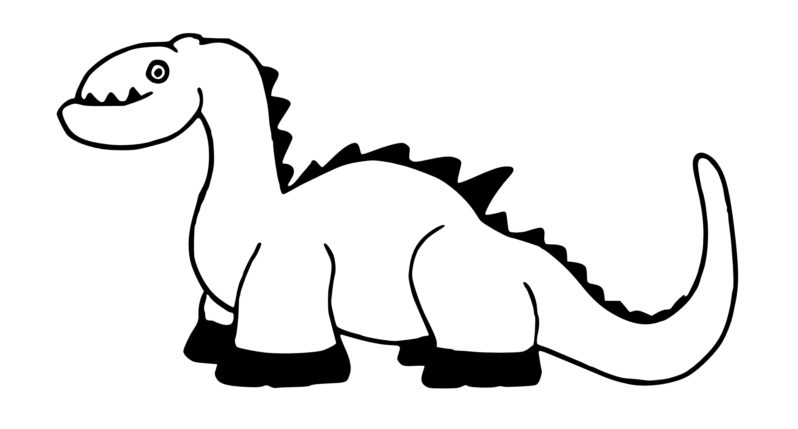

---
title       : Functions in R
subtitle    : Explained with dinosaurs
author      : Colin Pistell
job         : MS Business Analytics 2016
framework   : io2012        # {io2012, html5slides, shower, dzslides, ...}
highlighter : highlight.js  # {highlight.js, prettify, highlight}
hitheme     : solarized_dark      # 
widgets     : []            # {mathjax, quiz, bootstrap}
mode        : selfcontained # {standalone, draft}
knit        : slidify::knit2slides
---&vc2 bg:url(./assets/img/chaos.jpg);background-size:cover
<style>.title-slide {background:url(./assets/img/minimalistic-dinosaur.jpg);background-size: cover}</style>

<h1 class="emph wtxt txtcent">This is what your code is like without functions</h1>

---&vc2 bg:url(./assets/img/raptor.gif);background-size:cover

<h1 class="wtxt emph txtcent">Time to teach your code some manners!</h1>

---bg:url(./assets/img/paints.jpg);background-size:cover

<h1 class="wtxt emph2">Getting Started</h1>
<br>
<br>
<ul>
<li class="wtxt bgtxt">Functions aren't that hard</li>
<li class="wtxt bgtxt">Actually they'll make your life much easier</li>
<li class="wtxt bgtxt">Experimentation is key</li>
</ul>

---.paper

## The Basic Idea

<br>
<ul>
<li class=bgtxt>Good programmers are lazy</li>
<li class=bgtxt>They want to type as little as possible</li>
<li class=bgtxt>It would be nice if particularly useful algorithms & bits of code could be bundled together and used repeatedly with little effort</li>
<li class=bgtxt>That's what functions do!</li>
</ul>

---.paper

## The Good News

If you've used R at all, then you've already used functions. A lot of useful ones come built in to R. Let's look at some:

```{r}
vals <- rnorm(100) #We generate 100 random normal variables with the rnorm() function
mean(vals) #And we then calculate their average with the mean() function
```

Imagine if every time you wanted to calculate the mean of some numbers you had to code the algorithm from scratch. That would be bad. 

---.paper

## Introducing Pseudocode

We'll be exploring some fundamental concepts of functions using pseudocode

- When using pseudocode, we try to implement all logical/control aspects of a program but we use more natural language.
- It's a great way of figuring out how you're going to solve a problem with code before worrying about the nitty gritty of getting the syntax right.



- Example: mean(vector) = sum of all items in vector/length of vector
- There are varying levels of formality - we won't be going very formal.


---.paper

## Programming a Dinosaur

Let's imagine that we are responsible for programming a dinosaur to get around in the Cretaceous period.

- She's going to need to have a few basic capabilities to survive, namely navigating, hunting, fleeing from predators, etc.

- A lot of basic behaviors are common to many of these activities. If we coded them all from scratch each time we'd end up doing a lot of typing and repeating ourselves quite a bit.

- We'll code these basic behaviors as functions and then use those functions to easily create more complex skills... and save ourselves a lot of typing!

---.paper

## The Basics & Running

Let's teach our dinosaur to run. In (highly simplified) pseudocode, our running script will look something like this:

    1. Lean Forward
    2. Drive Right Leg against Ground AND Pull Left Leg forward
    3. Drive Left Leg against Ground AND Pull Right Leg forward
    
In the real world there will always be a context behind why the dinosaur is running, but we're going to purposefully ignore that for now. This is because <b>a function should only do one thing and do it well.</b>


---.paper

## Making a Function

In most languages, R included, turning code into a function is simple - we simply wrap the code in the appropriate function statement... something like this:

    Run = Function{
    1. Lean Forward
    2. Drive Right Leg against Ground AND Pull Left Leg forward
    3. Drive Left Leg against Ground AND Pull Right Leg forward
    }

So far so good, but our dinosaur is going to need to do more than just run. Let's teach her to pounce, which will introduce the concept of an <b>Argument.</b>

---.paper

## Arguments

Let's create a quick pouncing function for our dinosaur. Something like this:

    Pounce = Function {
    1. Jump
    2. Extend claws
    3. Land
    }

You've probably already spotted the problem with this function... what are we pouncing? To fix this we need to add an argument - essentially an object the function uses or acts on. Let's try this:

    Pounce(Target) = Function {
    1. Jump towards Target
    2. Extend claws
    3. Land on Target
    }

---.paper

## Using Functions

We now have the tools to build some more complex behavior, like hunting. We'll use the functions we've already made to save ourselves a lot of work:

    Hunt(Dinner) = Function{
    1. While Distance to Dinner > 3 meters, Run() towards Dinner
    2. Pounce(Target = Dinner)
    }

Nice! Notice that our Run function has an set of parenthesis after it. This is because it takes no arguments. Also notice that we fed the argument from our Hunt function into Pounce.

Time to use our new Hunt function! Let's tell our dinosaur to hunt a Hadrosaur:

    Hunt(hadrosaur)

Easy!

---.paper

## Flexibility

We touched on this idea before, but you want your functions to do just one thing and do that thing well. This maximizes its flexibility and usefulness. For example, let's now use our Run function for another important job - running away!

    Flee(Predator) = Function {
    1. While Predator is in sight, Run() away from Predator
    2. Hide()
    }

- Because our Run function was just about running, we could reuse it here.
- Notice we also used a function called Hide. Think (in pseudocode) how this function might work!

---.paper

## Function Output and Returns

Thus far our functions have just done stuff, but haven't generated any information of their own. Most of the time though we'll want our functions to <b>return</b> some sort of output.

- This output can be printed to a console, <b> assigned to a variable</b> and/or <b> fed into the arguments of another function!</b>

- Reread that last sentence. It's really important. Let's underline it with a diplodocus.

<div class=centered>

</div>

---.paper

## Function Output Example

Let's teach our dinosaur to look around for food and predators:

    Search(Area) = Function {
    1. Look around Area until AnotherDinosaur is spotted
    2. Return(AnotherDinosaur)
    }

Returned objects can be of any data type. Let's teach our dinosaur to size up other dinosaurs:

    SizeUp(Target) = Function {
    1. IF Target.Size > My.Size, Return(TRUE)
    2. ELSE, Return(FALSE)
    }
    
Why not put those together? Remember, functions should do just one thing. Breaking them up this way makes them more flexible, which we'll see in a moment...

---.paper

## Putting it all together.

We've created quite a few functions - Run, Pounce, Hunt, Flee, Search and SizeUp. We've learned about Arguments and Returns. And, we've taught our dinosaur a few good tricks. Now let's combine everything and give our girl some real intelligence. Using our functions, it'll be easy. See if you can follow the flow of Arguments, Variables, and Returns:

    1. While awake:
    2. otherDino = Search(Surroundings)
    3. isItBigger = SizeUp(otherDino)
    4. IF isItBigger = TRUE, Flee(otherDino)
    5. ELSE, Hunt(otherDino)

Make sense? Obviously our pseudocode is extremely oversimplified, but you can see how we can build some pretty complex behavior without a lot of extra typing.

---.paper

## Enough with the dinosaurs Colin. What do actual R functions look like?

Here's a quick example:

```{r}
squareMinusOne <- function(x) {
    result <- x^2 - 1
    return(result)
}

myVar <- squareMinusOne(5)
print(myVar)
```

Try to identify the Argument and the Returned value. Also notice that we assigned the output of the function to a variable.

---&vc2 bg:url(./assets/img/moto.gif);background-size:cover

<h1 class="emph wtxt txtcent">Now go forth and conquer - with Functions!</h1>

---&vc2 bg:#656F76

<div class=centered>
<p class="txtcent bgtxt wtxt"><b>Thanks for reading!</b></p>
<p class="txtcent wtxt">contact me at pistell@colorado.edu</p>

</div>
